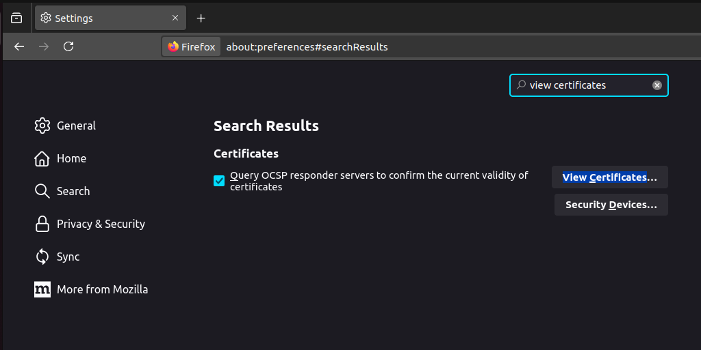
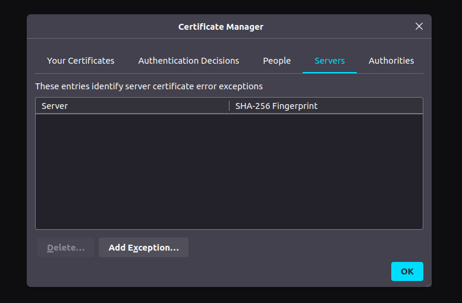
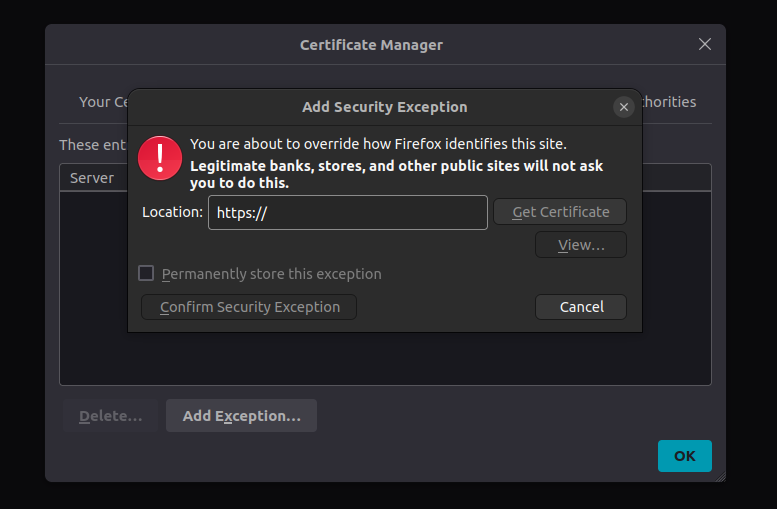
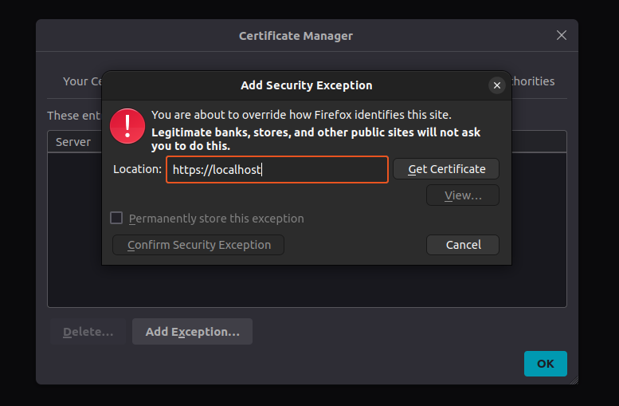
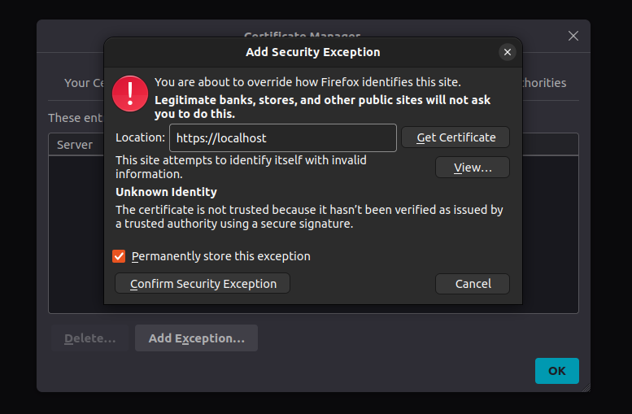
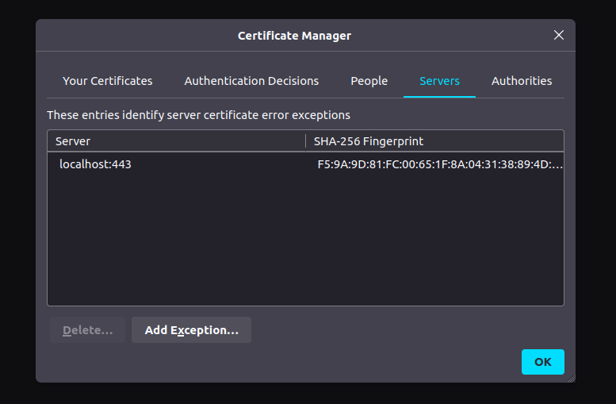
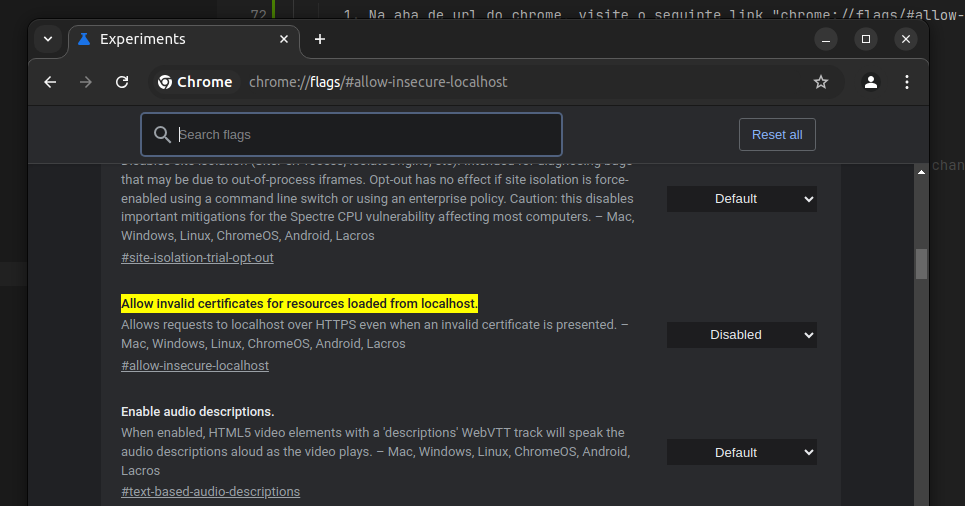
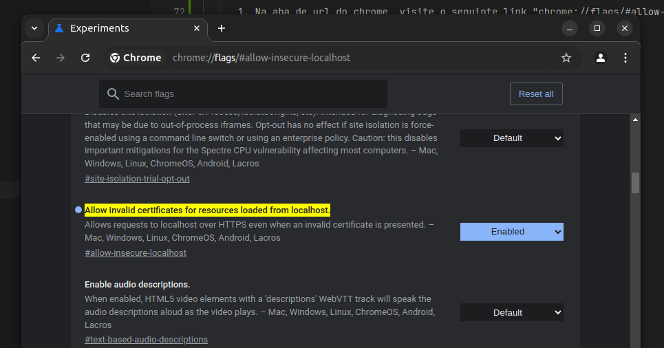

#### OBS: se não tiver o prettier configurado no VSCode, antes de fazer o commit, rodar o comando:

- `npm run format`

#### Esse comando npm existe tanto no pacote do front-end quanto no back-end, e ele ajudará a formatar o código.

#### Artefatos do projeto

| Nome                   | Link                                                                                                                                                                                   |
| ---------------------- | -------------------------------------------------------------------------------------------------------------------------------------------------------------------------------------- |
| Board Jira             | [Board Jira](https://girlana.atlassian.net/jira/software/projects/HAR/boards/2/backlog?selectedIssue=HAR-1&atlOrigin=eyJpIjoiODdjYmE0NDkwZDBhNGQ0OTljZTMwM2RmMThhMGYwNjIiLCJwIjoiaiJ9) |
| Arquivos do projeto    | [Artefatos do projeto](https://drive.google.com/drive/u/1/folders/16TCtNZZ3lYauk0t9vL2RTFM7vuZV1jdy)                                                                                   |
| Requisitos Harmoniq    | [Requisitos Harmoniq](https://docs.google.com/presentation/d/10web-aG_SvuQ1wdRRtHusYH86GY_ZnVB/edit#slide=id.p1)                                                                       |
| Prototipação das telas | [Figma Harmoniq](https://www.figma.com/design/RBa7DIUBbVLbq2b5RB4iv2/Harmoniq?node-id=0-1)                                                                                             |

#### Sobre o build das imagens:

- Para quem quiser acessar as imagens que estão em push no Docker Hub:
  - backend :   sailewebacad/harmoniq_backend
  - frontend :   sailewebacad/harmoniq_frontend

#### Instruções de push:

1. Faça o pull do repositório.
2. Acesse a branch main e crie uma nova branch.
   > git checkout -b "nome-da-nova-branch"
3. Desenvolva a funcionalidade.
4. Antes de fazer o git add, chamar o comando npm para ajustar a formatação do seu código.
   > npm run format
5. Continuar com o commit padrão.
6. Após o término, você vai fazer o push dessa branch para o repositório.
   > git push --set-upstream origin nome-da-branch

#### Instruções para rodar o projeto:

###### Para nosso projeto há pelo menos 3 maneiras de rodar o projeto.

1. Fazendo pull das imagens (Imagens do app pronto para produção).
   - sailewebacad/harmoniq_backend
   - sailewebacad/harmoniq_frontend
2. Rodando o Docker Compose da pasta raiz (o Docker Compose está configurado para desenvolvimento, apesar de usar o Dockerfile da imagem em prod, o que pode tornar demorado o primeiro run).
3. A última opção é rodar o projeto front-end ou back-end independentemente usando os comandos npm disponíveis para cada um.

### configuração SSL (para desenvolvimento)

- Configuração para o firefox.

      1. Nas configurações do firefox -> "about:preferences" busque por "view certificates".

  

      2. Em "view certificates", na aba "Services" click em "add Exception".

  

      3. Abrirá uma aba para adicionar uma excessao de sergurança, nela adicione "localhost".

  

  

      4. Depois de adiconar "localhost" click em "Get Certificate" logo após exapandirar as opções e ira liberar a opção "Confirm Security Exception"

  

      5. Pronto, agora não havera problemas de certificado ssl para localhost

  

- Configuração para o chrome.

      1. Na aba de url do chrome, visite o seguinte link "chrome://flags/#allow-insecure-localhost"

  

      2. Mude a configuração para enable

  

      3. Pronto, o chrome vai acessar o protocolo https sem bloqueiar, mas havera uma flag de warning.
